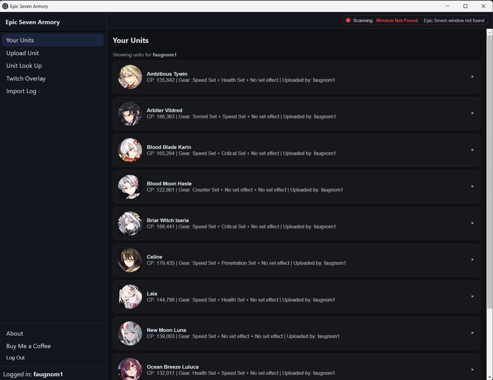
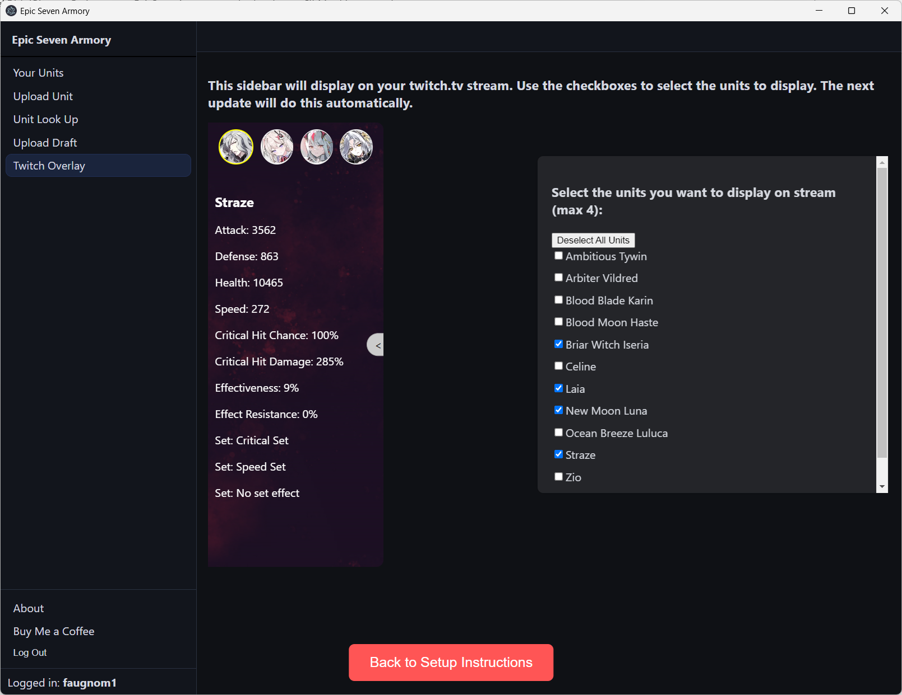
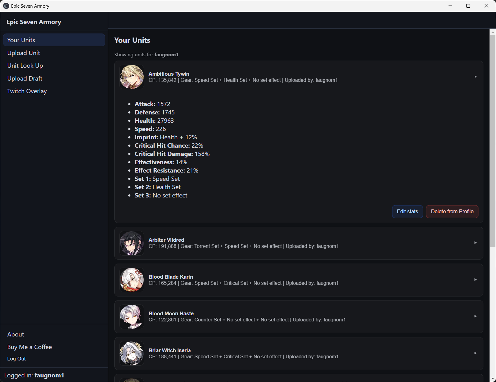
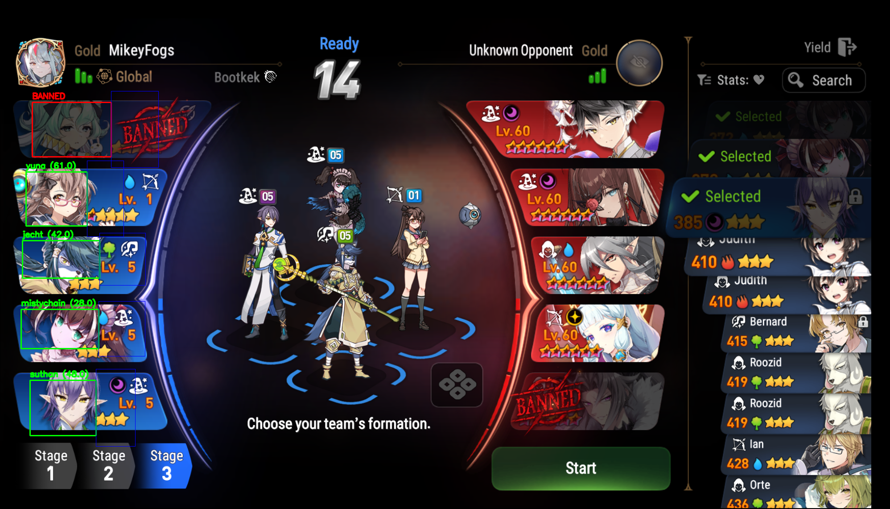

# Epic Seven Armory

**Desktop Unit Tracker, Auto-Scanner & Twitch Overlay for Epic Seven**

Epic Seven Armory is a desktop application and Twitch extension that helps players catalogue their roster, automatically capture hero stats while playing, detect RTA draft picks in real time, and broadcast selected units live to Twitch viewers — all without interrupting gameplay.



---

## Features

### Auto Unit Import (OCR)

Turn on the **Hero Import** toggle in the app header and browse your heroes normally. When the app detects that you have been on a hero's stat screen for ~2 seconds it silently captures the screen, runs OCR to extract all combat stats, and adds or updates the unit in your roster automatically.

- Detects the Epic Seven game window and monitors it at 2 Hz
- Anchor template matching triggers capture after a 2-second dwell
- pytesseract OCR extracts name, CP, ATK, DEF, HP, SPD, Crit Chance/Damage, Effectiveness, Effect Resistance, and gear sets
- Fuzzy name matching resolves OCR misreads against the full official hero list; heroes not yet in the Smilegate API are covered by a maintained override list
- Every import is logged with timestamp and event type (added / updated)
- Toast notification confirms each import: _"Added: Blood Moon Haste (122,861 CP)"_

### Auto Draft Detection (SIFT)

Turn on the **RTA Scan** toggle and the app monitors your screen for the RTA draft interface using SIFT feature matching. When the draft screen is detected:

- A frame is captured and analysed against your saved unit portraits
- Matched picks and bans are identified and pushed to the Twitch overlay instantly
- A toast confirms the detected units
- No manual input required during a match

### Twitch Extension Overlay

A native Twitch extension overlays up to four of your units directly on your stream video — no browser source needed.

- Real-time updates driven by the Auto Draft Scanner
- Viewers can click each unit tab to expand full stat breakdowns
- Hero portrait images pulled from Epic7DB; Aither's portrait used as placeholder for heroes whose images are not yet available
- Secure Twitch OAuth linking — link your account once from the Profile page

### Unit Roster & Manual Upload

- Your Units page lists every imported hero with expandable stat cards, sortable by name or CP
- Inline editor lets you correct any OCR misread without re-scanning
- Manual upload path accepts E7 stat screenshots or a Fribbels Gear Optimizer export (`.json`)
- Hero Library lets you look up any hero in the game and view their stats, bio, and build info
- Auto-Import Log shows a timestamped history of every Hero Import event (added / updated / error)
- Manual Override page lets you push up to 4 units to the overlay instantly — useful if the auto-scan picks the wrong heroes

---

## How It Works

```
┌─ Epic Seven Game Window ──────────────────────────────────────┐
│  Hero stat screen detected (anchor template match, 2 s dwell) │
└───────────────────────────────┬───────────────────────────────┘
                                │ captured frame
                                ▼
                     unit_scanner.py (Python)
                     OCR via pytesseract
                                │ hero name + stats
                                ▼
                     Flask /auto_import/unit
                     upsert → MongoDB ImageStats
                     log   → MongoDB scan_events
                                │
                                ▼
              Electron app shows toast + updates Your Units

┌─ RTA Draft Screen ────────────────────────────────────────────┐
│  SIFT feature match detects draft UI                          │
└───────────────────────────────┬───────────────────────────────┘
                                │ detected unit slugs
                                ▼
                     Flask /scan/result
                     upsert → MongoDB selected_units
                                │
                                ▼
              Twitch extension polls for selected units
              → overlay updates live on stream
```

---

## Tech Stack

| Layer              | Technology                                      |
| ------------------ | ----------------------------------------------- |
| Desktop shell      | Electron                                        |
| UI                 | React, Vite, React Router                       |
| Backend API        | Flask (Python)                                  |
| Database           | MongoDB Atlas                                   |
| Image processing   | OpenCV, SIFT feature matching                   |
| OCR                | pytesseract                                     |
| Window capture     | mss, pywin32 (PrintWindow)                      |
| Auth               | Google OAuth (PKCE desktop flow), Twitch OAuth  |
| Tokens             | HS256 JWT                                       |
| Twitch integration | Native Twitch Extension (Overlay + Config page) |

---

## Setup

### Prerequisites

- Google account (used for login)
- Epic Seven PC client (standalone, not emulator)

Download and run the installer from the [Releases](https://github.com/michael-faugno-dev/EpicSevenArmory/releases) page.

---

## Twitch Extension Setup

1. **Link Twitch** — open the Profile page in the app (click your username in the sidebar) and click **Link Twitch Account**
2. **Install the extension** — search for _Epic Seven Armory_ in your [Twitch Extensions Manager](https://dashboard.twitch.tv/extensions) or use the direct link from the app's Twitch Overlay page
3. **Configure** — click ⋯ → Configure and enter your Epic Seven Armory username
4. **Activate** — click Activate → **Set as Overlay 1**
5. **Test** — go live, turn on the **RTA Scan** toggle, and complete the ban phase of an RTA match — your units will appear on stream once the ban phase is over

---

## Project Status

Actively developed and used as a live streaming tool. Features, detection accuracy, and UI continue to evolve based on real gameplay testing.

- Targets the **standalone Epic Seven PC client** window
- Designed for long uptime and live streaming reliability
- Data stored in MongoDB solely for the Twitch overlay — no analytics or third-party tracking

---

## Screenshots






